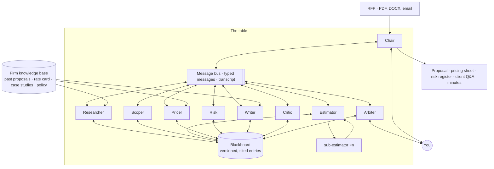

# Roundtable

**A multi-agent proposal team. Send it an RFP; get back a proposal, a price, the risks, and the minutes of how the agents argued their way there.**

Responding to a request for proposal is a team sport: someone researches the client, someone scopes the work, someone estimates, someone prices, someone checks the contract terms, someone writes, and someone tears the draft apart before it goes out. It takes a week and the best people in the company. Roundtable is that team as nine AI agents around one table: they work in parallel, hand work to each other through typed messages, object to each other with evidence, and a Chair keeps the meeting moving until the proposal is done or a human is needed.

> **Status: building in public.** Phase 0 of 5. This repository is a plan being executed in the open; nothing runs yet. The collaboration protocol, the agents, the architecture and the evaluation strategy are in [`docs/`](docs/). Progress is tracked in the [issues](../../issues).

Built by [Shreyas Pachpute](https://shreyaspachpute.in). Sister project of [Dispatch](https://github.com/shreyas-pachpute/dispatch), which is about running a back office; Roundtable is about agents *deliberating*. MIT licensed.

---

## Why this exists

Single-agent systems are good at tasks. They are bad at *judgment calls that need more than one perspective*: is this scope realistic, is this price defensible, is this clause a risk, does this draft actually answer what the client asked. Real teams solve that with disagreement. Most multi-agent demos solve it with a supervisor that tells workers what to do and never lets them argue.

Roundtable is built around the argument:

- **A shared blackboard.** One versioned workspace every agent reads and writes: requirements, assumptions, work packages, estimates, prices, risks, draft sections. Every entry has an owner and evidence.
- **A meeting protocol.** The Chair runs rounds: brief, research, draft in parallel, critique, reconcile, finalise. Turns have budgets; rounds have limits; nothing loops forever.
- **Objections with evidence.** Any agent can object to any entry, but only with a citation. The owner revises or defends; an Arbiter decides; unresolved objections go to a human with both sides in one screen.
- **Fan-out and fan-in.** The Estimator spawns a sub-estimator per work package, then reconciles them and explains the variance. The Writer drafts sections in parallel and the Critic scores them against the client's own evaluation criteria.
- **A human at the table.** You can join at any point: answer an open question, override a price, veto a clause. The team continues from there and the minutes record it.
- **Minutes.** The output is not just a proposal. It is the proposal, a pricing sheet, a risk register, a client Q&A list, and a readable record of who said what, what changed and why.

## A meeting, start to finish

The demo client is *Harbor Logistics*, a fictional 3PL that has issued an RFP for a warehouse-management integration. The responding firm is *Meridian Systems*, a fictional 25-person consultancy with twelve past proposals, a rate card, case studies and a margin policy in its knowledge base. Everything is synthetic. See [`docs/DEMO.md`](docs/DEMO.md).

| Round        | What happens                                                                                                    | Who                                 |
| ------------ | --------------------------------------------------------------------------------------------------------------- | ----------------------------------- |
| Brief        | The 34-page RFP becomes a requirements matrix: 61 requirements, each with a page citation and a priority          | **Chair**, **Scoper**               |
| Research     | Client context, past comparable proposals, three relevant case studies, two competitor signals                    | **Researcher**                      |
| Scope        | Nine work packages with assumptions and open questions for the client                                             | **Scoper**                          |
| Estimate     | One sub-estimator per package, reconciled; package 6 flagged: two estimates disagree by 40%                       | **Estimator** and its sub-agents    |
| Price        | Rate card plus margin policy plus what won last time; a discount proposed on package 3 with a reason              | **Pricer**                          |
| Risk         | Four contract terms flagged, one unlimited-liability clause marked as a must-negotiate                              | **Risk**                            |
| Draft        | Sections written in parallel in the firm's voice, every claim linked to a case study or the matrix                | **Writer**                          |
| Critique     | Scored against the RFP's stated evaluation criteria; two sections sent back; one objection to the price           | **Critic**                          |
| Reconcile    | The price objection is argued with evidence and settled; the liability clause is escalated to a human             | **Arbiter**, then you               |
| Finalise     | Proposal, pricing sheet, risk register, client Q&A and the minutes                                                 | **Chair**                           |

Every row is a planned behaviour with an evaluation case behind it. When the phase that delivers it ships, the row links to the recorded run.

## The table

| Agent          | Job                                                                                          | Talks to                          |
| -------------- | -------------------------------------------------------------------------------------------- | --------------------------------- |
| **Chair**      | Runs the protocol, assigns turns, enforces budgets and round limits, decides when it is done | Everyone                          |
| **Researcher** | Client, market and past-proposal context, with sources                                       | Scoper, Writer, Pricer            |
| **Scoper**     | Turns the RFP into a requirements matrix, work packages, assumptions and open questions      | Estimator, Writer, Critic         |
| **Estimator**  | Effort and schedule per package, via fan-out sub-estimators and reconciliation               | Pricer, Critic                    |
| **Pricer**     | Price from the rate card, margin policy and memory of past deals; explains every deviation   | Critic, Arbiter                   |
| **Risk**       | Contract terms, compliance, delivery risks; a register with severity and a recommended stance | Writer, Arbiter                   |
| **Writer**     | Proposal sections in the firm's voice, every claim cited                                     | Critic                            |
| **Critic**     | Scores the draft against the client's evaluation criteria; raises objections with evidence   | Everyone, through the Chair       |
| **Arbiter**    | Settles objections the owner and objector cannot; escalates to a human when evidence is even | Chair, you                        |

Full specifications, tools and evaluation cases per agent: [`docs/AGENTS.md`](docs/AGENTS.md). The protocol itself, message types, objection rules and how deadlocks are prevented: [`docs/COLLABORATION.md`](docs/COLLABORATION.md).

## How it works

## What makes it different

1. **Agents disagree, on the record.** Objections are first-class objects with evidence, an owner, a status and a resolution. The minutes show them.
2. **Structure prevents chaos.** A fixed protocol with turn budgets and round limits. No unbounded chatter, no two agents editing the same entry at once, no infinite objection loops.
3. **Everything cited.** A number in a proposal traces to the rate card, a past deal, or the matrix. A claim traces to a case study. The Critic rejects anything that does not.
4. **The human is a participant, not a rubber stamp.** Join mid-meeting, answer, override, veto. The team adapts and the record shows it.
5. **Evaluated like a team, not a chatbot.** Requirement recall, estimate consistency, policy compliance, proposal score against a rubric versus human-written baselines, objection resolution correctness. A change that lowers a score does not merge.
6. **Your models.** Claude Opus 5 for the Chair, Critic and Arbiter; Sonnet 5 for research and drafting volume; a vLLM path for firms that keep documents in-house.

## Stack

| Layer        | Choice                                                                | Why                                                                              |
| ------------ | --------------------------------------------------------------------- | -------------------------------------------------------------------------------- |
| Agents       | Python, LangGraph (one supervisor graph, one subgraph per agent)      | Explicit state, replayable rounds, testable nodes                                |
| Models       | Claude via the Anthropic SDK; vLLM for self-hosted models             | Judgment where it matters, volume where it does not; a private path from day one |
| Blackboard   | Postgres with versioned entries and pgvector for past-deal memory     | One store, one history, one backup                                               |
| Research     | Firm knowledge base via MCP; web search through the model's server-side tool | Sources attached to every finding                                          |
| Bus          | Typed messages (Pydantic) over a Postgres outbox; full transcript     | Every hand-off inspectable and replayable                                        |
| Meeting room | Next.js: live transcript, blackboard, objections, join-in             | The owner watches the meeting and can step in                                    |
| Outputs      | DOCX and PDF export, CSV pricing sheet, Markdown minutes              | What a client and a sales lead actually use                                      |
| Evals        | pytest, deterministic checks plus rubric judges, CI gate              | Quality is a number that must not go down                                        |

## Roadmap

Detailed plan with definition of done per phase: [`docs/PLAN.md`](docs/PLAN.md).

- [ ] **Phase 0 · Foundations** — blackboard, message bus and transcript, supervisor skeleton, meeting room shell, tracing, CI
- [ ] **Phase 1 · Brief and research** — RFP ingestion, requirements matrix with citations, Researcher, Scoper
- [ ] **Phase 2 · Estimate and price** — Estimator with fan-out/fan-in, Pricer with policy and memory, consistency checks
- [ ] **Phase 3 · Write, critique, reconcile** — Writer, Risk, Critic, objection protocol, Arbiter, human join-in
- [ ] **Phase 4 · Deliverables and hardening** — exports, minutes, evals as a CI gate, cost budgets, vLLM path, demo recording

## Running it

Not yet. Phase 0 delivers `docker compose up` and `make meeting` on the Harbor Logistics RFP.

## License

MIT. See [`LICENSE`](LICENSE).
